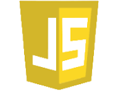

- Olá, me chamo Renato Matos 🤓
- Sou engenheiro de softwares, atualmente trabalho com processamento de grande volume de dados utilizando majoritariamente PL/SQL, também desenvolvo aplicações Web, integrando os objetos oracle ao back-end Java.

## Skills

